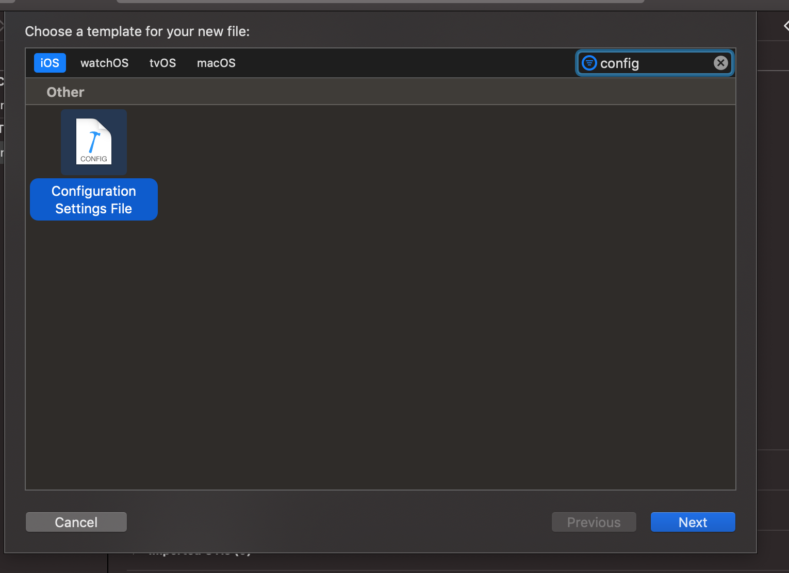

## IOS Setup Part I: Basics
Note: This guide is only for react-native 0.6+

Install the package:

```
$ yarn add react-native-config
```

Run pod install

```
(cd ios; pod install)
```

Create a new file `.env` in the root of your React Native app:

```
API_URL=https://myapi.com
GOOGLE_MAPS_API_KEY=abcdefgh
```

Then access variables defined there from your app:

```js
import Config from "react-native-config";

Config.API_URL; // 'https://myapi.com'
Config.GOOGLE_MAPS_API_KEY; // 'abcdefgh'
```

Run your app with this command and check if your .env file can be read 
```
ENVFILE=.env react-native run-ios
```

## IOS Setup Part II: Flavoring

1. Click on the file tree and create new file of type XCConfig
   
   
2. Save it under `ios` folder as with the name "Config" and add the following content:

```
#include? "tmp.xcconfig"
```

3. Add the following to your ".gitignore":

```
# react-native-config codegen
ios/tmp.xcconfig

```

4. Go to project settings
5. Apply config to your configurations
   
6. In the Xcode menu, go to Product > Scheme > Edit Scheme -> _Build_ -> _Pre-actions_, click _+_ and select _New Run Script Action_. Paste below code which will generate "tmp.xcconfig" before each build exposing values to Build Settings and Info.plist. Make sure to select your target under _Provide build settings from_, so `$SRCROOT` environment variables is available to the script. 
   ```
   "${SRCROOT}/../node_modules/react-native-config/ios/ReactNativeConfig/BuildXCConfig.rb" "${SRCROOT}/.." "${SRCROOT}/tmp.xcconfig"
   ```

   

7. You can now access your env variables in the Info.plist, for example `$(MY_ENV_VARIABLE)`.

8.Create a new scheme:

- In the Xcode menu, go to Product > Scheme > Edit Scheme
- Click Duplicate Scheme on the bottom
- Give it a proper name on the top left. For instance: "Myapp (staging)"
- Make sure the "Shared" checkbox is checked so the scheme is added to your version control system

Then edit the newly created scheme to make it use a different env file. From the same "manage scheme" window:

- Expand the "Build" settings on left
- Click "Pre-actions", and under the plus sign select "New Run Script Action"
- Where it says "Type a script or drag a script file", type:
  ```
  cp "${PROJECT_DIR}/../.env.staging" "${PROJECT_DIR}/../.env"  # replace .env.staging for your file
  ```
Also ensure that "Provide build settings from", just above the script, has a value selected so that PROJECT_DIR is set.

Add these shortcut commands into package.json
```
"scripts": {
    ...    
    "ios-sdev": "react-native run-ios --scheme \"your scheme name here\"",
    "ios-ssb": "react-native run-ios --scheme \"your scheme name here\"",
    "ios-sprod": "react-native run-ios --scheme \"your scheme name here\"",    
  },
```

9. Configure app name based on .env file

Define app name variable in .env file
```
APP_NAME=your app name
```

On Xcode, go to info.plist, assign the variable you defined to `Bundle Display Name`

10. Finally, try running your app with a package.json command
```
 yarn ios-sdev
```


